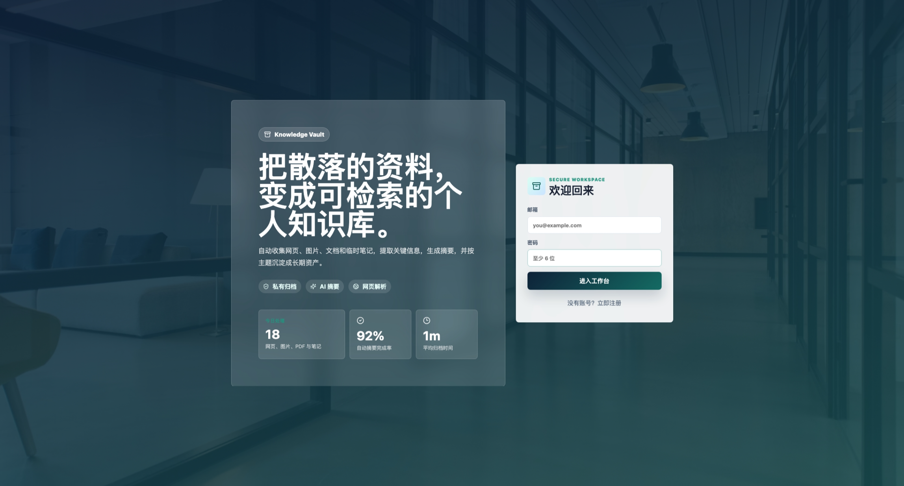
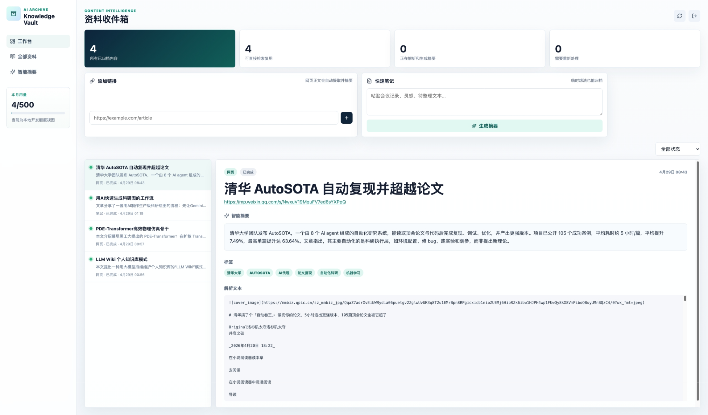

# 用 Codex 1 个多小时，0 成本做出一个可上线的 AI 资料归档应用

> 这是一篇项目复盘，也是一份给普通开发者的实践记录：如何用 Codex 作为结对工程师，从一个模糊想法出发，在本地完成产品设计、前后端开发、数据库初始化、AI 解析摘要、GitHub 托管和 Vercel 发布。

最终项目地址：

- 线上应用：[https://knowledge-vault-five-orcin.vercel.app](https://knowledge-vault-five-orcin.vercel.app)
- GitHub 仓库：[https://github.com/YixiaoOneSmile/knowledge-vault](https://github.com/YixiaoOneSmile/knowledge-vault)



## 一、最初的需求

我的原始想法很简单：

我希望有一个应用，可以把图片、网页链接、文档、临时笔记发给它，它自动帮我解析、存档，并生成一个简单摘要。界面要现代、明亮、简洁，最好像一个真正能收费的 SaaS 产品。

技术上我希望尽量轻量：

- 前端：Vue 3 + Vite
- 后端与数据库：Supabase
- 登录：Supabase Auth
- 文件存储：Supabase Storage
- AI 摘要：OpenAI 兼容接口，可接代理地址和 key
- 网页解析：优先 Firecrawl，没有 key 时用免费直接抓取方案兜底
- 部署：GitHub + Vercel

也就是说，目标不是做一个玩具页面，而是做一个“能落地”的最小产品。

## 二、为什么用 Codex

这次开发我没有从空白项目一点点敲代码，而是把 Codex 当成一个全栈工程搭子。

整个过程里，Codex 做了这些事：

- 理解需求并确定项目结构
- 在本地创建 Vue 3 + Vite 项目
- 设计 Supabase 数据表和 RLS 权限
- 编写 Supabase Edge Function
- 实现登录、上传、链接归档、摘要展示等前端功能
- 做 UI 迭代，从简单 demo 改成更商业化的 SaaS 工作台
- 初始化 Supabase
- 部署 Edge Function
- 创建 Git 仓库
- 推送 GitHub
- 部署到 Vercel
- 检查线上返回状态

我负责的是提出需求、补充 key、登录授权，以及根据实际效果提出审美反馈。

这种协作方式很像：我做产品经理和验收，Codex 做架构师、工程师和运维。

## 三、第一版：先把功能跑通

Codex 一开始没有急着堆视觉，而是先把核心链路跑起来：

1. 用户注册/登录
2. 添加网页链接
3. 上传文件
4. 粘贴文本笔记
5. 写入 Supabase
6. 调用 Edge Function 解析
7. 调用大模型生成摘要
8. 回写数据库
9. 前端展示归档列表和详情

核心表是 `archive_items`，大概包含这些字段：

- `kind`：资料类型，网页、文件或笔记
- `title`：标题
- `source_url`：网页地址
- `storage_path`：文件存储路径
- `mime_type`：文件类型
- `status`：排队中、处理中、已完成、失败
- `summary`：AI 摘要
- `content_text`：解析后的文本
- `tags`：标签

Supabase 里还加了 RLS 权限，保证每个用户只能看到自己的资料。这一点很重要，因为如果要做成真实产品，登录和数据隔离不能靠“以后再说”。

## 四、解析与摘要：免费优先，可插拔升级

网页解析这块，Codex 设计成了两层：

- 如果配置了 `FIRECRAWL_API_KEY`，优先使用 Firecrawl 抓取网页正文
- 如果没有配置 Firecrawl，就直接 `fetch` 网页 HTML，再做基础文本清理

这样好处是：

- 初期可以 0 成本跑起来
- 后续需要更强网页解析时，直接加 Firecrawl key
- 不会因为第三方服务没配置而整个应用不可用

Firecrawl 这块还有一个细节值得单独说一下：它本身有免费额度，大概可以先用 500 次来做验证。对一个早期原型来说，这个额度已经足够测试网页解析链路。

更有意思的是，Firecrawl 是开源项目。如果后面真的开始高频使用，或者担心免费额度不够，也可以考虑本地或服务器自部署一个 Firecrawl，把网页解析能力收回到自己的基础设施里。这样成本结构会从“按调用付费”变成“自己承担服务器资源”，更适合长期稳定运行的知识库产品。

AI 摘要则放在 Supabase Edge Function 里，而不是浏览器端。这样大模型 key 不会暴露给用户。

环境变量分成两类：

前端 Vite 变量：

```bash
VITE_SUPABASE_URL=...
VITE_SUPABASE_ANON_KEY=...
```

服务端 Edge Function secrets：

```bash
OPENAI_BASE_URL=...
OPENAI_API_KEY=...
OPENAI_MODEL=...
OPENAI_VISION_MODEL=...
FIRECRAWL_API_KEY=...
```

这个结构非常适合做 SaaS 原型：浏览器只拿 publishable key，真正敏感的 AI key 放服务端。

模型成本也做成了可替换设计。当前使用的是 `gpt-5.4-mini` 这类小模型，实际处理一次资料大约是 3 到 5 分钱人民币，体验和效果都比较稳。如果后续对成本更敏感，也可以切到 DeepSeek V4 这类更便宜的模型。按输出约 0.5 元 / 百万 token 的价格估算，大批量摘要的成本会明显下降。

这也是为什么我没有把模型写死在代码里，而是放在 `OPENAI_MODEL` 里：只要代理接口兼容 OpenAI 格式，换模型基本就是改一个环境变量。

## 五、从 demo UI 到“能收费”的 SaaS UI

第一版界面很简洁，但看起来还是偏 demo。于是我提出了一个审美要求：

> 希望界面布局是那种商用软件的美观程度，像一个让人付费订阅的应用。

Codex 随后把界面重构成更成熟的 SaaS 工作台：

- 登录页做成产品 hero
- 加入背景图、品牌徽章、卖点标签
- 主界面改成左侧导航 + 顶部栏 + 数据指标卡 + 收集面板 + 资料列表 + 详情面板
- 资料状态用视觉点标识
- 摘要详情做成 AI 分析卡片
- 响应式适配窄屏

这一步非常关键。很多 AI 生成项目最大的问题不是不能用，而是“看起来不值得信任”。商业软件的第一眼质感，会直接影响用户是否愿意继续体验。



## 六、Supabase 初始化

本地功能写完后，Codex 继续帮我初始化 Supabase。

过程中做了这些事：

```bash
npx supabase init
npx supabase link --project-ref <project-ref>
npx supabase db push
npx supabase functions deploy process-item
```

这里有两个细节让我印象比较深：

第一个是 Supabase CLI 需要登录，不是填项目的 publish key，也不是 secret key，而是需要 Supabase access token。

第二个反而是一个惊喜：Supabase Auth 不只是提供用户表和登录接口，它还自带注册验证邮件能力。用户注册后，Supabase 会自动发一封邮箱验证邮件，这意味着一个正式产品里非常基础但很麻烦的账号安全流程，几乎不用自己写。

本地测试时，如果还没点邮箱验证链接，登录会提示 `400 email not confirmed`。这不是坏事，而是 Supabase 默认帮我们开启了更安全的注册流程。如果只是本地快速调试，可以去 Supabase Dashboard 里临时关闭 Email confirmation；如果准备给真实用户使用，我更建议保留邮箱验证，这会让产品从第一天就更像一个正规的 SaaS。

这类细节如果自己摸索，会消耗很多时间。Codex 的价值就在于它能快速识别问题属于“代码问题”还是“平台配置问题”。

## 七、GitHub 托管

项目完成后，Codex 初始化了 Git 仓库：

```bash
git init
git branch -M main
git add .
git commit -m "Initial Knowledge Vault app"
```

然后使用 GitHub CLI 创建仓库并 push：

```bash
gh repo create knowledge-vault --private --source=. --remote=origin --push
```

这里还有一个很重要的安全检查：

Codex 确认 `.env`、`node_modules`、`dist`、Supabase `.temp`、Vercel 本地元数据都没有进入 Git。

尤其是 `.env`，里面有 Supabase 和模型服务相关配置，绝对不能提交到公开仓库。

## 八、Vercel 发布

部署使用 Vercel CLI：

```bash
npx vercel --prod --yes
```

Vercel 自动识别了 Vite 项目，构建命令是：

```bash
npm run build
```

输出目录是：

```bash
dist
```

部署成功后，Codex 还做了两件收尾工作：

1. 把 Vercel 生产环境变量写入项目配置
2. 再次生产部署，确保线上版本使用 Vercel 环境变量构建

最后验证线上地址返回 `HTTP 200`。

最终线上地址：

[https://knowledge-vault-five-orcin.vercel.app](https://knowledge-vault-five-orcin.vercel.app)

## 九、这次用到的技术栈

前端：

- Vue 3
- Vite
- TypeScript
- lucide-vue-next

后端与平台：

- Supabase Auth
- Supabase Postgres
- Supabase Row Level Security
- Supabase Storage
- Supabase Edge Functions

AI 与解析：

- OpenAI 兼容 Chat Completions API
- 可选 Firecrawl
- 直接网页 fetch 兜底
- 图片走视觉模型

工程与发布：

- Git
- GitHub CLI
- Vercel CLI
- Vercel Hosting

## 十、0 成本是怎么做到的

这次能做到 0 成本，主要是因为使用了各个平台的免费额度：

- Vue / Vite：免费开源
- GitHub：免费托管代码
- Vercel：免费部署静态前端
- Supabase：免费额度足够原型验证
- Supabase Auth：自带注册、登录和验证邮件，省掉一大块账号系统开发成本
- Firecrawl：免费额度可以先用约 500 次；不配置也可以直接抓网页；长期还可以自部署
- 大模型：当前 `gpt-5.4-mini` 大约 3 到 5 分钱处理一次；如果换成 DeepSeek V4，输出约 0.5 元 / 百万 token，成本还能继续压低

严格来说，如果你的大模型调用量变大，AI 摘要会产生费用。但从项目开发和上线角度看，基础设施成本可以压到几乎为 0。

## 十一、这次 Codex 最有价值的地方

我最大的感受是：Codex 不只是“帮你写代码”，而是能把一个想法推进到可访问的线上产品。

它有几个特别有价值的能力：

1. 能补齐工程链路，不只写页面
2. 能处理 Supabase、Vercel、GitHub 这种平台配置
3. 会主动避免提交密钥
4. 能根据反馈迭代 UI
5. 会跑构建检查，而不是写完就结束
6. 能把部署 URL、仓库地址、验证结果整理清楚

这让开发过程从“我一个人查文档、写代码、试错”变成了“我提出方向，Codex 推进落地”。

## 十二、适合复制的开发流程

如果你也想用 Codex 快速做一个落地项目，可以参考这个流程：

1. 用自然语言描述产品目标，而不是只描述技术
2. 明确技术栈和边界，比如 Vue、Supabase、Vercel
3. 先让 Codex 做 MVP，不要一开始追求完美
4. 功能跑通后，再要求它提升 UI 到商业级
5. 所有 key 都走 `.env` 或平台 secrets
6. 让 Codex 帮你跑 build 和部署
7. 最后让它写 README 和项目总结

一个比较好的提示词结构是：

```text
我想做一个 xxx 应用，目标用户是 xxx。
希望它支持 xxx 功能。
技术栈使用 xxx。
界面希望是 xxx 风格。
请在当前目录创建项目，本地跑起来，并帮我部署。
注意不要把任何 key 写死到代码里。
```

## 十三、后续可以继续增强什么

当前版本已经可以作为可演示 MVP，但如果要做成真正收费产品，还可以继续加：

- PDF / DOCX 深度解析
- 自部署 Firecrawl，降低高频网页解析成本
- 模型路由，根据资料长度和重要程度在 `gpt-5.4-mini`、DeepSeek V4 等模型间自动切换
- OCR
- 标签自动聚类
- 全文搜索
- 收藏夹和项目空间
- 浏览器插件
- 微信/Telegram/邮件转发入口
- Paddle 或 Lemon Squeezy 订阅支付
- 用户额度和套餐管理
- 后台管理面板

也就是说，这个项目不是终点，而是一个已经能跑起来的起点。

## 结语

过去做一个这样的应用，至少要经历：建项目、搭登录、写数据库、写上传、调 AI、处理权限、做 UI、部署、排错。

这次借助 Codex，我在 1 个多小时内完成了从想法到线上地址的完整闭环。

AI 编程工具真正改变的，不只是写代码速度，而是让一个人可以更轻松地完成过去需要前端、后端、运维、产品多角色协作才能完成的事情。

这就是我觉得它值得分享的原因。
